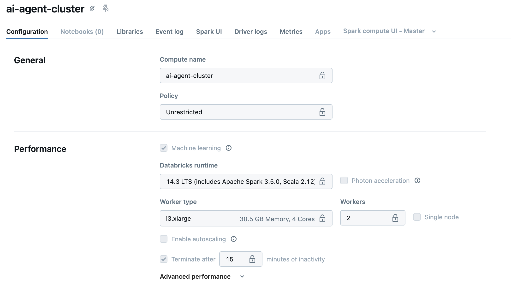
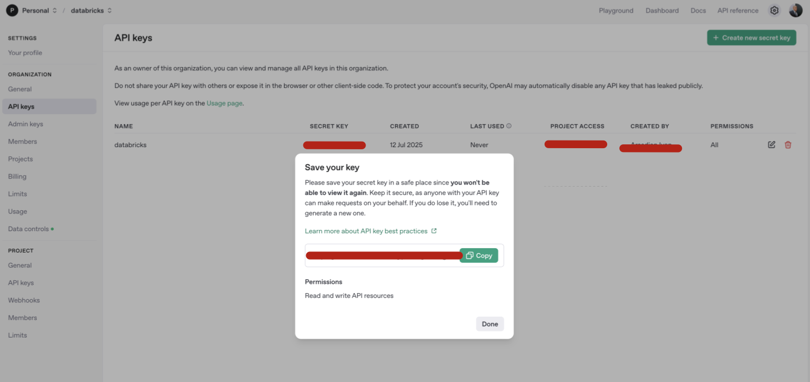
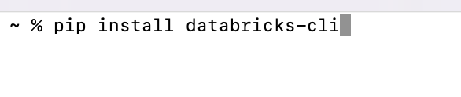
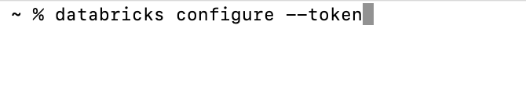
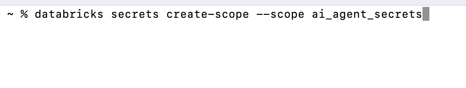
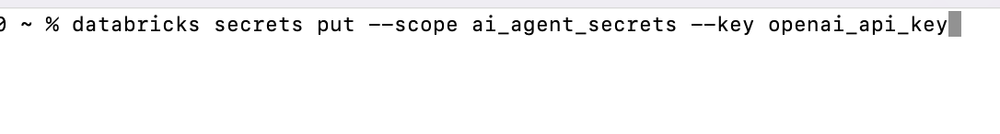
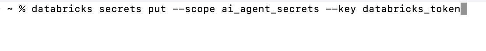

# Building a simple and cost-effective implementation of a Financial Compliance AI Agent on Databricks

# Step-by-Step Guide

## Stack: Databricks, OpenAI, LangChain

## Use Case: Financial Regulatory Compliance Automation

This guide demonstrates how to build an AI agent that helps financial institutions automate regulatory compliance tasks such as:

- Analyzing transaction patterns for suspicious activities
- Reviewing documentation for compliance requirements
- Answering compliance-related queries
- Generating compliance reports

## Prerequisites

- Databricks workspace with Unity Catalog enabled
- Access to Databricks SQL and MLflow
- Python knowledge
- No GPU required (CPU-only setup)

### Step 1 - Setup your Environment

### 1.1 Create a new Databricks Cluster

### 1.2 Setup OpenAI API Key

### 1.3 Using Databricks CLI Configure your Databricks Token and and Secrets

